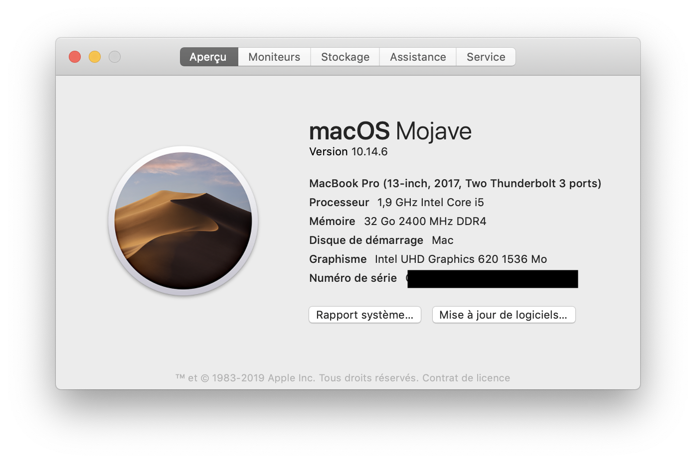
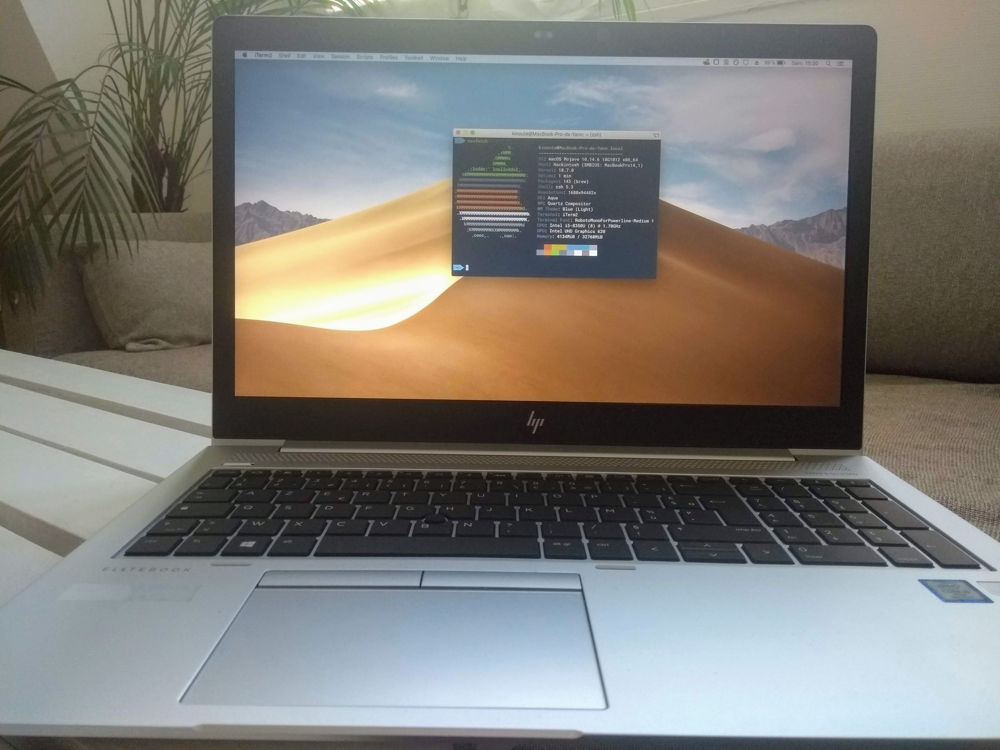
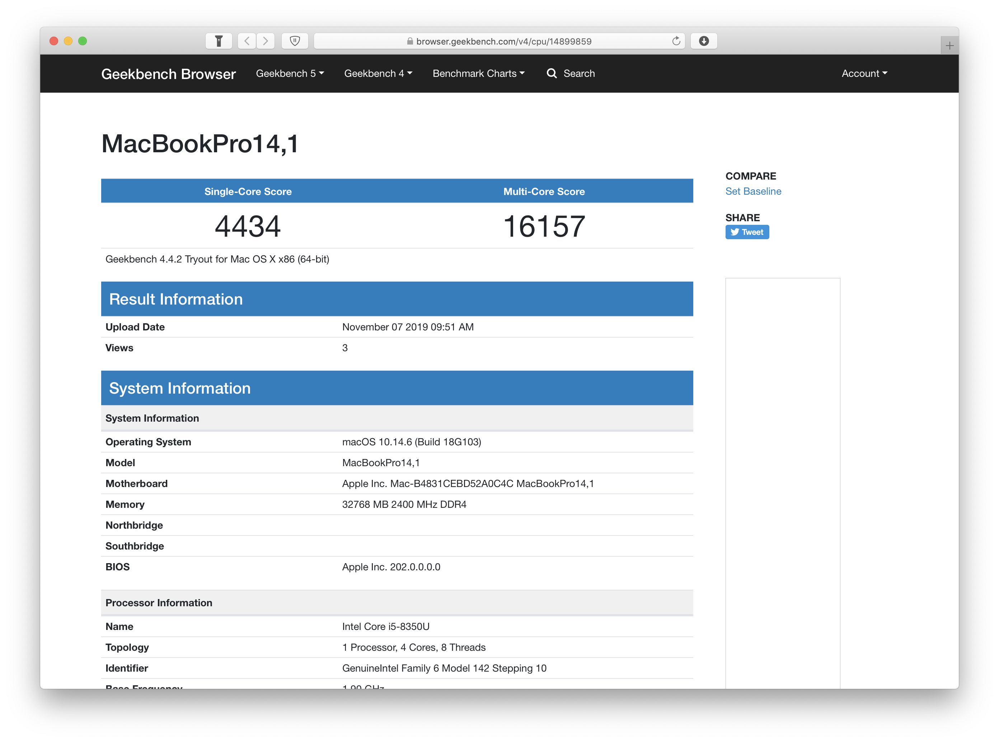

# HP EliteBook 850 G5 Hackintosh

A HP EliteBook 850 G5 Hackintosh running Mojave 10.14.6.

## Description

I have already two Hackintoshes :

* A desktop [Hackintosh](https://github.com/kinoute/Hack-Z370-HD3P-i5-8400) at home with a i5-8400 and a Gigabyte Z370-HD3P ;
* A Dell Latitude E6430 [Hackintosh](https://github.com/kinoute/Hack-Dell-Latitude-E6430) I was given at work.

I had the chance to put my hands on a nice HP EliteBook 850 G5 Laptop and couldn't resist, again, to install macOS on it.

## Laptop Specs

* macOS Mojave 10.14.6
* Intel i5-8350U vPro @ 1.7 Ghz, TurboBoost @ 3.6 Ghz (4 cores, 8 threads)
* Samsung M471A2K43CB1-CTD 32GB DDR4-RAM SDRAM SO-DIMM @ 2400 Mhz
* Intel UHD Graphics 620 1536 Mb
* Toshiba XG5 KXG50ZNV1T02 1TB NVMe SSD PCIe 3.1a 
* 15.6" FHD IPS anti-glare LED-backlit @ 120 Hz (used as retina display, see below)

## What works

* Speakers
* Headphones output
* Trackpad with gestures
* USB 3 Ports
* USB-C (tested with a HP Docking station)
* LAN/Ethernet
* Fn keys to change volume or brightness
* Battery percentage/status
* Sleep/Wake-up
* HDMI Out
* HP Sure View (makes your screen difficult for onlookers to view from the sides)
* FileVault 2 (you can use it, kexts for that are already in my EFI folder)

## Doesn't work / Not tested

* **Webcam :** The camera seens recognized by the system but doesn't work
* **WIFI :** Need to change the internal card. I use a [TP-Link-TL-WN725N](https://www.tp-link.com/us/home-networking/usb-adapter/tl-wn725n/) USB Dongle since I don't own the laptop (drivers for macOS [here](https://www.tp-link.com/us/support/download/tl-wn725n/#Driver)).

## Installation

### BIOS Settings

BIOS with this particular laptop was difficult to setup. You have to disable a lot of things, especially "Secure Boot". In order to do that, you will have to enter a PIN Code after the change to validate that, indeed, you really want to disable it.

My BIOS Settings in general are available as pictures here : [BIOS](BIOS/README.md)

### Creating the USB Installer

You will need a 16+ GB USB, a Mac and an internet connection to download the Mojave Installer.
Open the App Store, search for "Mojave", download it.

While it's downloading, use Disk Utility to format your USB Drive as Mac OS X Extended (Journaled) and rename your USB stick to "USB" (just to be easier). Don't forget to change before the partition table to `GPT` when formatting the USB Stick. Every USB comes with `MBR` partition by default because it's the most compatible one for external medias. But we want a `GPT` partition. So in Disk Utility, enable the "Show All Devices Option" in the menu (it's in the "Presentation" or "View" menu). Select your USB Stick and erase the whole USB with `GPT` option selected.

Once the download is done, open the Terminal and write:

`sudo "/Applications/Install macOS Mojave.app/Contents/Resources/createinstallmedia" --volume /Volumes/USB`

It will copy the installer to your USB Stick and make it bootable. It can take some time.

### Install Clover on the USB Installer

Once we have a USB Installer, we need to install Clover on it, with our `config.plist` file and the needed kexts for our laptop. Here are the steps:

* Download Clover **r5093**: https://github.com/Dids/clover-builder/releases/tag/v2.5k_r5093
* Start the Clover-Minimal installation app
* Make sure to select your USB Stick as the destination during the installation. We also want to Customize the installation so click on "Customize"
* Check these items in the customize list:
    - Install for UEFI booting only
    - Install Clover in the ESP
    - drivers/UEFI/AppleUiSupport
    - drivers/UEFI/SMCHelper-64
    - drivers/UEFI/ApfsDriverLoader
    - drivers/UEFI/AptioMemoryFix
    - drivers/UEFI/HFSPlus
    - drivers/UEFI/AppleGenericInput

### Copy my EFI Folder

Download my EFI Folder from this repo and copy it (replace, not merge) to your USB Installer existing EFI Folder. It will replace your EFI folder that was created by Clover during the installation, copy all the necessary kext files and my `config.plist` file as well.

## macOS Mojave Installation

Reboot your Laptop with the USB Installer stick plugged in. Press `ESC`, choose `Boot Menu (F9)` and pick your USB Stick, it should boot to Clover. Pick your USB Installer in the menu, the Mojave Installer will start to load. You can encounter various graphics glitches during this step, it's fine.

Once you reach the Mojave Installer, launch the Disk Utility app and in the menubar, in the "presentation" menu (or similar, don't remember the name), enable "Show all devices". That way, we will see our internal hard drive completely in Disk Utility. Format it as Mac OS X Extended (Journaled) and pick the scheme "GUID Partition Map" or similar.

Now close the Disk Utility and start the Installer.

## Post-Installation

You should now have a running Hackintosh. After reaching the Desktop, the first thing to do is to install Clover but this time on your Laptop HDD (right now we were able to boot thanks to the USB Installer and Clover on it).

Basically redo all the same steps described before : Install Clover, pick this time your Laptop HDD as destination, same customize settings. Then copy my EFI Folder to the Laptop's HDD EFI.

### Generate your serials

By default, my `config.plist` file doesn't contain any serial. You need to generate yours. You can use [macserial](https://github.com/acidanthera/macserial) to generate serials for the model we picked (MacBookPro14,1). To do that, download macserial, open the Terminal, go to the folder that contains macserial (`cd /folder/that/contains/macserial`) and run:

`./macserial -a | grep -i 'MacBookPro14,1'`

It will output some table with the following structure "Product | Serial | Board Serial (MLB)". Add the serial and the Board Serial to your `config.plist` with any text editor or with Clover Configurator and save it. Now you should be able to boot without your USB Installer plugged-in.

### Internet

You can use the LAN/Ethernet which works OOTB. For the WIFI, you need to replace the internal card with a compatible one. You can find plenty of them on eBay. Otherwise, the cheaper and quicker solution is to use a USB Dongle WIFI. I own a [TP-Link-TL-WN725N](https://www.tp-link.com/us/home-networking/usb-adapter/tl-wn725n/) and it works great. Once you have plugged it in one of your USB ports, install the drivers. You can find them for Mojave here: https://www.tp-link.com/us/support/download/tl-wn725n/#Driver. Reboot, done.

## HIDPI / Retina Resolution

You can enable retina options with this FHD monitor by using this script: https://github.com/xzhih/one-key-hidpi. 

Staying at 1920x1080 resolution on this laptop is quite hard because the text is too small to my taste. After applying this script, I use the retina resolution of 1680x944 @ 120 Hz which is a good compromise between space and crispy font.

## The Beast

## Benchmarks

Link: https://browser.geekbench.com/v4/cpu/14899859

## Credits

Huge thanks to [kecinzer](https://www.tonymacx86.com/members/kecinzer.1373007/) from tonymacx86 for making his EFI available and fixing the touchpad issues. Props to him for everything.

